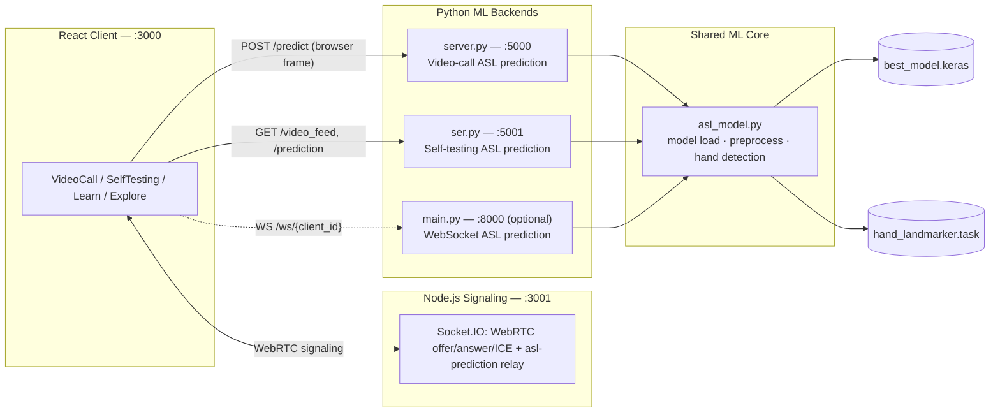

# HandTalk

**Real-time American Sign Language detection, built into video calls, self-testing, and learning.**

[](https://github.com/bharat3645/HandTalk/actions/workflows/ci.yml)
[](LICENSE)
[](client)
[](server/index.js)
[](server)
[](docker-compose.yml)

HandTalk is a real-time American Sign Language (ASL) detection system integrated into video calls. It aims to facilitate communication for people who use ASL by recognizing hand gestures and converting them into text — live, during video calls, and standalone in a self-testing/learning mode. Recognition is powered by a [MobileNetV2](https://www.researchgate.net/publication/339806434_Efficient_mobilenet_architecture_as_image_recognition_on_mobile_and_embedded_devices)-based classifier, fine-tuned on 30,000+ hand images, paired with MediaPipe hand-landmark detection.

## Table of Contents

- [Overview](#overview)
- [Features](#features)
- [Tech Stack](#tech-stack)
- [Architecture](#architecture)
- [Project Structure](#project-structure)
- [Getting Started](#getting-started)
  - [Prerequisites](#prerequisites)
  - [1. Clone the repository](#1-clone-the-repository)
  - [2. Client (React frontend)](#2-client-react-frontend)
  - [3. Signaling server (Node.js)](#3-signaling-server-nodejs)
  - [4. ML backends (Python)](#4-ml-backends-python)
  - [5. Or: run everything with Docker](#5-or-run-everything-with-docker)
- [Environment Variables](#environment-variables)
- [API Reference](#api-reference)
- [Testing & CI](#testing--ci)
- [Model Training](#model-training)
- [Screenshots](#screenshots)
- [Demo](#demo)
- [License](#license)

## Overview

Video calls are usually built assuming everyone communicates by speaking. HandTalk closes that gap: it watches a signer's hands through the webcam, classifies the ASL letter being shown in real time, and surfaces it as text to the other participant in the call — no separate interpreter, hardware glove, or app required beyond a browser. A second, standalone mode lets anyone practice and learn ASL fingerspelling with live feedback, hold-to-commit sentence building, and text-to-speech.

## Features

- **Real-time ASL detection in video calls** — frames captured in-browser during a WebRTC call are classified letter-by-letter and relayed to the other participant as text, over a Socket.IO signaling channel.
- **Self-Testing & ASL learning** — an interactive page for practicing ASL fingerspelling with live per-frame predictions.
- **Sentence building + text-to-speech** — the Self-Testing page debounces predictions (a sign must be held steadily for ~0.9s, with a live hold-progress indicator, before it's committed), so it produces an actual sentence instead of a flickering raw per-frame guess. The model's `space` / `delete` classes are wired to real word-separator / backspace behavior. A **Speak** button (and an optional "speak each letter as I sign it" mode) reads the result aloud via the Web Speech API — no backend required.
- **Health-check endpoints on every backend** — `GET /health` on `server.py`, `ser.py`, `main.py`, and `index.js`, each reporting real readiness: model/labels/hand-landmarker/camera state, WebSocket connection count, or registered-user count and uptime.
- **Input validation hardening** — `/predict` rejects missing, non-string, or malformed-base64 payloads with `400` instead of crashing, and caps request bodies at 8 MB. `main.py`'s WebSocket handler rejects malformed frame/JSON payloads instead of raising. Flask debug mode is off by default (opt in via `FLASK_DEBUG`), closing a Werkzeug-debugger-RCE-in-production footgun.
- **Shared ML core** — `server.py`, `ser.py`, and `main.py` all share one implementation of model loading, preprocessing, and hand detection (`server/asl_model.py`) instead of three hand-copied versions, so a bug fix only needs to happen once.
- **Automated regression test suite + CI** — a `pytest` suite exercises real model loading, real 29-way softmax inference, label parsing, hand-bounding-box math, and real `HandLandmarker` initialization, guarding against the exact two "everything silently crashes on startup" bug classes this project has hit before (Keras deserialization, a removed mediapipe API). Wired into GitHub Actions (`.github/workflows/ci.yml`): client production build, a live boot + `/health`-poll smoke test of the signaling server, the pytest suite, and a build of all three Dockerfiles — on every push and pull request.
- **One-command Docker stack** — `docker compose up --build` builds and runs the client (nginx), the signaling server, and both ASL-prediction backends together, wired up with the health checks above.

## Tech Stack

| Layer | Technology |
|---|---|
| Frontend | React 18, React Router, Socket.IO client |
| Signaling | Node.js, Express, Socket.IO |
| ASL inference (video call) | Flask, TensorFlow/Keras, OpenCV |
| ASL inference (self-testing) | Flask, TensorFlow/Keras, OpenCV |
| ASL inference (experimental WebSocket) | FastAPI, WebSockets |
| Hand detection | MediaPipe Tasks (`HandLandmarker`) |
| Model | Fine-tuned MobileNetV2 (29-class softmax: A-Z, space, delete, blank) |
| Text-to-speech | Web Speech API (client-side, no backend) |
| Containerization | Docker, Docker Compose, nginx |
| CI | GitHub Actions |
| Testing | pytest |

## Architecture



Each backend also exposes `GET /health`, polled by Docker's healthcheck and by CI's smoke test.

## Project Structure

```
HandTalk/
├── client/                   # React frontend
│   ├── .env.example          # Template for REACT_APP_* API/socket URLs
│   ├── Dockerfile            # Multi-stage build -> nginx static serve
│   └── src/pages/            # Home, Learn, Explore, VideoCall, SelfTesting, Navbar
├── server/
│   ├── .env.example          # Template for PORT
│   ├── best_model.keras      # Trained model for ASL prediction
│   ├── hand_landmarker.task  # MediaPipe Tasks hand-landmark model
│   ├── labels.txt            # Class index -> ASL label mapping
│   ├── asl_model.py          # Shared model-loading/preprocessing/hand-detection logic
│   ├── requirements.txt      # Python dependencies
│   ├── requirements-dev.txt  # + pytest, for running server/tests/
│   ├── tests/                # pytest suite for asl_model.py
│   ├── Dockerfile.node       # Image for index.js
│   ├── Dockerfile.python     # Shared image for server.py / ser.py / main.py
│   ├── index.js              # Node.js/Socket.IO signaling server for WebRTC calls
│   ├── server.py             # Flask backend: video-call ASL prediction (port 5000)
│   ├── ser.py                 # Flask backend: self-testing ASL prediction (port 5001)
│   └── main.py                 # FastAPI/WebSocket backend for the experimental /temp page
├── docker-compose.yml        # One-command local stack
├── .github/workflows/ci.yml  # Client build, backend health smoke test, pytest, Docker builds
├── ModelTrain.ipynb          # Model training notebook (Colab)
└── LICENSE
```

> **Note on repo size:** `server/best_model.keras` (~19 MB) and
> `server/hand_landmarker.task` (~7.5 MB) are committed directly as regular
> Git objects — this repo does not use Git LFS. That means `git clone` pulls
> ~27 MB of binary model weights along with the source. This is intentional
> for now (see [Getting Started](#getting-started) below for why cloning
> already gives you a runnable model without a separate download step); a
> future cleanup may migrate them to Git LFS, but that would rewrite history
> and isn't done here to avoid breaking existing clones/forks.

## Getting Started

### Prerequisites

- [Node.js](https://nodejs.org/) 18+ and npm
- [Python](https://www.python.org/) 3.9+
- A webcam (for live video-call detection and self-testing)
- [Docker](https://www.docker.com/) (optional, for the one-command stack)

### 1. Clone the repository

```bash
git clone https://github.com/bharat3645/HandTalk.git
cd HandTalk
```

### 2. Client (React frontend)

```bash
cd client
npm install                  # Install all dependencies
cp .env.example .env         # Configure API URLs (defaults work for local dev)
npm start                    # Start the React frontend
```

### 3. Signaling server (Node.js)

```bash
cd server
npm install                  # Install backend dependencies
cp .env.example .env         # Configure the signaling server port
node index.js                # Start the Node.js server for WebRTC communication
```

### 4. ML backends (Python)

Create a virtual environment and install dependencies:

```bash
cd server
python -m venv venv
venv\Scripts\activate        # Windows
# source venv/bin/activate   # macOS/Linux
pip install -r requirements.txt
```

> `pip install` will print a resolver warning about `keras` (`tensorflow
> requires keras>=3.12.0, but you have keras 3.6.0`) — this is expected.
> `best_model.keras` only deserializes correctly under Keras 3.6.0; see the
> comment in `requirements.txt` for details.

Then start the backend(s) for the features you want:

```bash
python server.py   # ASL prediction for video calls (port 5000)
python ser.py       # ASL prediction for the self-testing page (port 5001)
```

`hand_landmarker.task` is committed to the repo already; if you ever need to
re-download it, it comes from Google's MediaPipe model zoo:

```bash
curl -L -o server/hand_landmarker.task \
  https://storage.googleapis.com/mediapipe-models/hand_landmarker/hand_landmarker/float16/latest/hand_landmarker.task
```

Now access the app at **http://localhost:3000**.

### 5. Or: run everything with Docker

If you have Docker installed, skip steps 2-4 entirely:

```bash
docker compose up --build
```

This builds and starts the client (nginx, port 3000), the signaling server
(port 3001), and both `server.py` / `ser.py` ASL-prediction backends (ports
5000 / 5001). Add `--profile experimental` to also start `main.py`'s
WebSocket backend (port 8000).

> **Webcam note:** `POST /predict` (used by the VideoCall page) captures
> frames in the *browser* and works fully containerized. `/video_feed`
> (used by the SelfTesting page) instead streams from the *container's*
> own webcam, which needs a physical camera device passed through — only
> possible on Linux hosts (see the commented `devices:` entries in
> `docker-compose.yml`). On Windows/macOS, run `python server/ser.py`
> directly on the host if you want to use Self-Testing.

Each service exposes `GET /health`, which Docker's healthcheck polls
automatically — run `docker compose ps` to see status at a glance.

## Environment Variables

**Client** (`client/.env`, copied from `client/.env.example`):

| Variable | Default | Purpose |
|---|---|---|
| `REACT_APP_SIGNALING_SERVER_URL` | `http://localhost:3001` | Node.js signaling server used by the video-call page |
| `REACT_APP_PREDICTION_API_URL` | `http://localhost:5000` | Flask server used for live ASL prediction during calls |
| `REACT_APP_SELFTEST_API_URL` | `http://localhost:5001` | Flask server used for the self-testing page |
| `REACT_APP_FASTAPI_WS_URL` | `ws://localhost:8000` | Optional FastAPI WebSocket backend for the experimental `/temp` page |

**Signaling server** (`server/.env`, copied from `server/.env.example`):

| Variable | Default | Purpose |
|---|---|---|
| `PORT` | `3001` | Port for `index.js` |

**Python ML backends** (`server.py`, `ser.py`, `main.py` read these directly from the environment):

| Variable | Default | Purpose |
|---|---|---|
| `MODEL_PATH` | `./best_model.keras` | Path to the trained ASL classifier |
| `LABELS_PATH` | `./labels.txt` | Path to the class-index-to-label mapping |
| `HAND_MODEL_PATH` | `./hand_landmarker.task` | Path to the MediaPipe hand-landmark model |
| `CAMERA_INDEX` | `0` (`server.py`) / `1` (`ser.py`) | Local webcam device index |
| `PORT` | `5000` / `5001` / `8000` | Port the service listens on |
| `FLASK_DEBUG` | off | Opt-in Flask debug mode (never enable in production) |

## API Reference

**`server.py`** (port 5000, powers ASL detection during video calls):

| Method & Path | Description |
|---|---|
| `GET /health` | Model/labels/hand-landmarker/camera readiness, plus uptime. Returns `503` if anything failed to initialize. |
| `GET /video_feed` | MJPEG stream of the local webcam with a hand-detection + ASL prediction overlay. |
| `GET /prediction` | Latest prediction produced by `/video_feed`. |
| `POST /predict` | Predicts the ASL sign for a single base64-encoded frame (used by the video-call page, which sends frames captured in-browser). Validates the payload (missing/non-string/malformed-base64 `image` all return `400` instead of `500`) and caps request size at 8 MB. |

**`ser.py`** (port 5001, powers the self-testing page):

| Method & Path | Description |
|---|---|
| `GET /health` | Same shape as `server.py`'s. |
| `GET /video_feed` | Same as above, for the self-testing camera. |
| `GET /prediction` | Latest prediction produced by `/video_feed`. |

**`index.js`** (port 3001, Socket.IO signaling server) relays WebRTC offers/answers/ICE candidates and forwards `asl-prediction` events between call participants in real time.

| Method & Path | Description |
|---|---|
| `GET /health` | Registered-user count + uptime. |

**`main.py`** (port 8000, optional FastAPI backend for the experimental `/temp` page):

| Method & Path | Description |
|---|---|
| `GET /health` | Model/labels/hand-landmarker readiness + active WebSocket connection count. |
| `WS /ws/{client_id}` | Receives video frames over a WebSocket, runs hand detection + ASL prediction, and returns the annotated frame and prediction. Malformed frame payloads are rejected (logged + ignored) instead of crashing the connection. |

`server.py`, `ser.py`, and `main.py` all share one implementation of the
model-loading/preprocessing/hand-detection logic, in `asl_model.py`, instead
of each carrying its own hand-copied version.

## Testing & CI

The core ML logic (`asl_model.py` — model loading, label parsing,
preprocessing, hand-bounding-box math, and MediaPipe hand detection) has a
`pytest` suite that runs without needing a webcam or a running Flask/FastAPI
server:

```bash
cd server
pip install -r requirements-dev.txt
pytest tests/ -v
```

These tests specifically guard against the two "everything silently crashes
on startup" bug classes this project hit historically: `best_model.keras`
failing to deserialize under a newer Keras release, and mediapipe removing
the `mp.solutions.hands` API it used to depend on. Both are exercised
end-to-end (real model load + real inference, real `HandLandmarker` init)
rather than mocked out, so a regression in either fails the suite
immediately instead of only showing up as a production crash.

This runs automatically in CI (`.github/workflows/ci.yml`) on every push and
pull request, alongside a client production build (`CI=true npm run build`),
a live boot + `/health`-poll smoke test of the signaling server, and a Docker
image build for all three Dockerfiles.

## Model Training

The model was trained using the **MobileNetV2** architecture, chosen for its
low computational cost from depthwise and pointwise convolutions — a good
fit for real-time, browser-facing inference. It was fine-tuned on 30,000+
ASL images by unfreezing 10 layers, in roughly 60 minutes, achieving high
accuracy on the 29-class task (A-Z, `space`, `delete`, `blank`). See
[`ModelTrain.ipynb`](ModelTrain.ipynb) for the full training pipeline.

### Why MobileNetV2?

- Lightweight and efficient
- Suitable for real-time inference
- Optimized for mobile and web applications

## Screenshots

### Real-time communication


### Self-testing & learning


## Demo

[Watch the demo video on YouTube](https://youtu.be/RaSgkDoy-VQ)

## License

Released under the [MIT License](LICENSE).

---

Built by [bharat3645](https://github.com/bharat3645).
